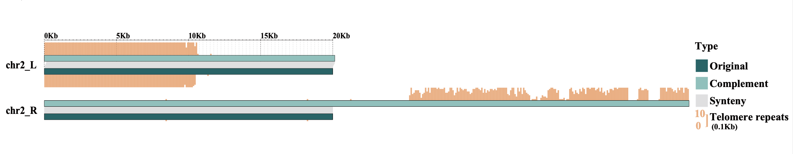

Collinearity Analysis   
=====================

Collinearity
------------

In **collinearity analysis**, the left and right ends of chromosomes from the original genome and the complemented genome (``new_genome.fasta``) are extracted for comparison, with the results output to genomeSyn_result. The number of telomeres at the corresponding chromosome ends of both genomes is also reported, including the files ``telomere.original.num.info`` and ``telomere.complement.num.info``.

.. code:: bash

    #  optional arguments:
    #  -h, --help            show this help message and exit
    #  -G1 , --genome1       Input the original genome file (FASTA format)
    #  -G2 , --genome2       Input new genome file (FASTA format)
    #  -pos                  The position information of telomere installed on the original
    #                        genome
    #  -m , --motif          Telomeric repeats sequences, e.g., plant: CCCTAAA(TTTAGGG),
    #                        animal: TTAGGG(CCCTAA), etc.
    #  --bin                 The bins for calculating the number of telomeres are divided into.
    #                        The bin size can be determined by the user, and the default value
    #                        is 100.
    #  --genomeSyn1          GenomeSyn1 is in the order of original genome first and new genome
    #                        second
    #  --genomeSyn2          genomeSyn2 is in the order of original genome second and new
    #                        genome first
    #  --length              Extract genome length
    #  -tel_max              The maximum value of telomere frequency within the calculated
    #                        length
    #  -C1 , --genome_color1 Set the color parameters of genome 1, the default is #04686b, or
    #                        select other hexadecimal or RGB color codes, such as
    #                        "#04686b"/"rgb(4,104,107)"
    #  -C2 , --genome_color2 Set the color parameters of genome 2, the default is #87c9c3, or
    #                        select other hexadecimal or RGB color codes, such as
    #                        "#87c9c3"/"rgb(135,201,195)"
    #  -C3 , --synteny_color Set the color parameters of the synteny blocks, the default is
    #                        #DFDFE1, or select other hexadecimal or RGB color codes, such as
    #                        "#DFDFE1"/"rgb(223,223,225)"
    #  -C4 , --telo_color    Set the telomere color parameters for displaying genomes, the
    #                        default is #fcaf7c, or select other hexadecimal or RGB color
    #                        codes, such as "#fcaf7c"/"rgb(252,175,124)"
    #  -t , --threads        Number of threads to use (default: 20)

    $ telocomp_Collinearity -G1 original_geonme.fasta \
                            -G2 new_genome.fasta \
                            -pos telomere_positions.txt \
                            --length 20000 \
                            -tel_max 10 \
                            -m CCCTAAA --genomeSyn2

Collinearity result
-------------------

Collinear alignment between the `Morus notabilis` original genome and the telomeric complemented genome (only chromosomes with complementary telomeres are shown).

