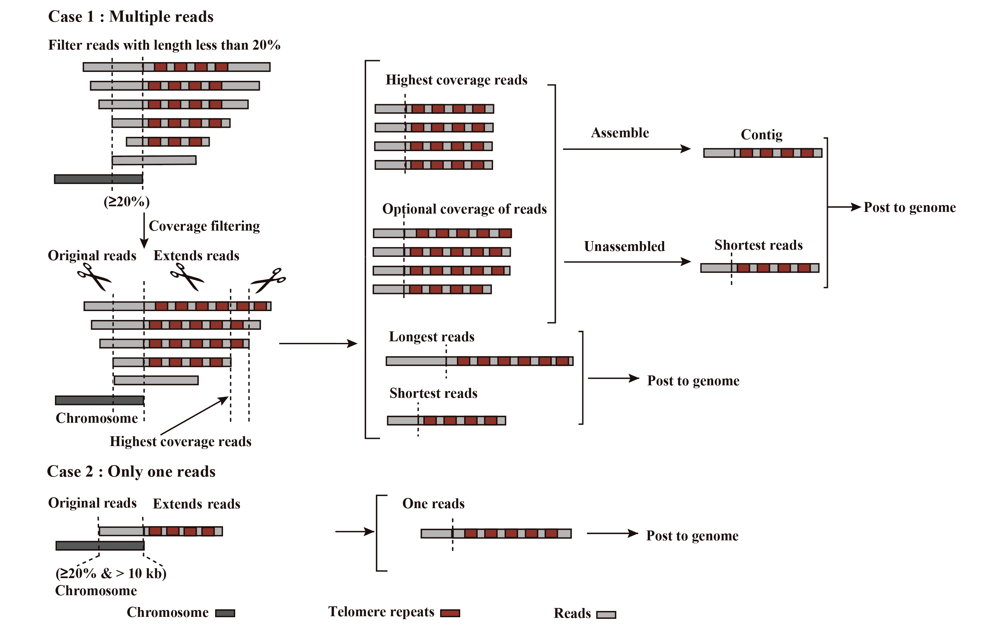

Schematic of Reads Filtering and Coverage Processing Rules
==========================================================

This diagram illustrates TeloComp’s mechanism for read filtering and coverage selection, and clarifies the relationship between the Assemble and Extract modules—if assembly is performed, reads are processed through the Assemble module; otherwise, the Extract module is used.

    Schematic diagram illustrating read sorting and coverage selection in TeloComp.
